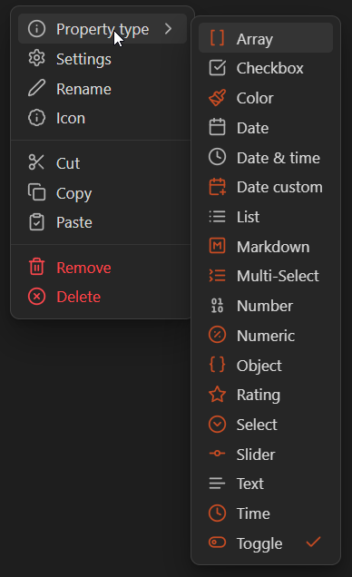

# Better Properties

Adds additional property types and configuration options to Obsidian's core **Properties View** plugin!

<div style="display: flex; gap: 5px;">




</div>

## Features

### General

-   Custom icon by property name
-   Custom icon and text colors
-   Mass update properties
-   Delete properties from all notes
-   Specify default hidden properties
    -   These will be hidden until the "Show hidden" button is clicked

### Additional property types

-   Dropdown
    -   Customizable options values and labels
-   Toggle
-   Color
-   Slider
    -   can set min, max, step, and if limits should be displayed
-   Button
    -   run inline JavaScript, a JavaScript file, or a command. (more options TBD)
-   Markdown (live preview)
    -   Obsidian only considers links here as "real" links (those that show in graph view, etc.) if the link is the only thing in the value.
-   Number+
    -   can set a min, max, and update via an expression
-   Stars
    -   can set custom star icon and count

## Roadmap

### Custom type widgets

-   [x] Dropdown
-   [x] Slider
-   [x] Toggle
-   [x] Color
-   [x] Number+
-   [x] Markdown
-   [x] Stars
-   [x] Button
-   [ ] JS
    -   Essentially a "custom" type. Executes arbitrary JS that receives the normal arguments provided to type widget render functions, allowing users to make a practically custom type widget
-   [ ] Progress
    -   May or may not do this. Most people probably would want JS to update this dynamically which is better suited for the JS type
-   [ ] ...more??

### Property icon menu

Additional options shown when clickong in the icon next to the property key

-   [x] delete property from all notes
-   [x] mass update property
-   [x] rename property
-   [x] configure property settings
-   [x] Show and link to notes that have this property
-   [x] change icon for property
-   [ ] ...more?

### Misc

-   [x] zod for validation
-   translation (i18Next) support
    -   [x] Replace all hardcoded strings
    -   [ ] Make guide for contributing translations and what are currently added/reviewed
-   sync with template
    -   [x] Customizable template-id property name
    -   [x] Customiable template proeprty name
    -   [x] Sync properties option in more options button menu
    -   [x] Option to show warning
    -   [ ] Option to delete extra properties
-   [ ] set groups for property names
    -   tried this by patching the `metdataEditor` prototype, but I could only move the rendered property after it was rendered, which causes an ugly flash of it being moved, plus some weird duplication I couldn't figure out.
-   [ ] nested properties
    -   a way to do 'grouped' properties that are just objects in YAML. Dataview already supports these, so I could use them to create a copy of the metdataEditor for each nested property 'group'.
-   [ ] render property within regular and inline codeblocks
    -   First implementation ready, need to review and refine
        -   [ ] Need to replace hard coded strings with i18next
        -   [x] Doesn't render in table cells. For reference, it looks like dataview has this issue but meta-bind doesn't.
            -   Fixed. However, when you click the cell obsidian switches the cell from reading to live-preview and places the cursor in the code text and unrenders the widget. Don't know a solution yet. Meta-bind has the same problem.
    -   allow render of individual property editors that can update the current note or other notes.
    -   inline code something like `&=propertyName: <string>, fileName: <string | undefined>, cssClass: <string | undefined>`
    -   Codeblock something like
        -   ```yaml
            propertyName: <string>
            filePath: <string | undefined> (defaults to current note)
            cssClass: <string | undefined>
            ```
